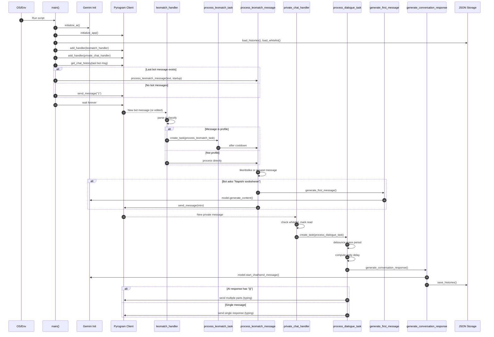

# Orchestrator Task Dispatch Sequence (Current State)

```mermaid
sequenceDiagram
    autonumber
    participant OS as OS/Env
    participant Main as main()
    participant AI as Gemini Init
    participant App as Pyrogram Client
    participant LeomatchH as leomatch_handler
    participant LeomatchTask as process_leomatch_task
    participant LeomatchExec as process_leomatch_message
    participant PrivateH as private_chat_handler
    participant DialogTask as process_dialogue_task
    participant GenFirst as generate_first_message
    participant GenReply as generate_conversation_response
    participant Store as JSON Storage

    OS->>Main: Run script
    Main->>AI: initialize_ai()
    Main->>App: initialize_app()
    Main->>Store: load_histories(), load_whitelist()

    Main->>App: add_handler(leomatch_handler)
    Main->>App: add_handler(private_chat_handler)
    Main->>App: get_chat_history(last bot msg)
    alt Last bot message exists
        Main->>LeomatchExec: process_leomatch_message(text, startup)
    else No bot messages
        Main->>App: send_message("1")
    end
    Main->>App: wait forever

    App-->>LeomatchH: New bot message (or edited)
    LeomatchH->>LeomatchH: parse & classify
    alt Message is profile
        LeomatchH->>LeomatchTask: create_task(process_leomatch_task)
        LeomatchTask->>LeomatchExec: after cooldown
    else Not profile
        LeomatchH->>LeomatchExec: process directly
    end
    LeomatchExec->>LeomatchExec: like/dislike or request message
    alt Bot asks "Napishi soobshenie"
        LeomatchExec->>GenFirst: generate_first_message()
        GenFirst->>AI: model.generate_content()
        LeomatchExec->>App: send_message(intro)
    end

    App-->>PrivateH: New private message
    PrivateH->>PrivateH: check whitelist, mark read
    PrivateH->>DialogTask: create_task(process_dialogue_task)

    DialogTask->>DialogTask: debounce grace period
    DialogTask->>DialogTask: compute reply delay
    DialogTask->>GenReply: generate_conversation_response()
    GenReply->>AI: model.start_chat/send_message()
    GenReply->>Store: save_histories()
    alt AI response has "|||"
        DialogTask->>App: send multiple parts (typing)
    else Single message
        DialogTask->>App: send single response (typing)
    end
```
