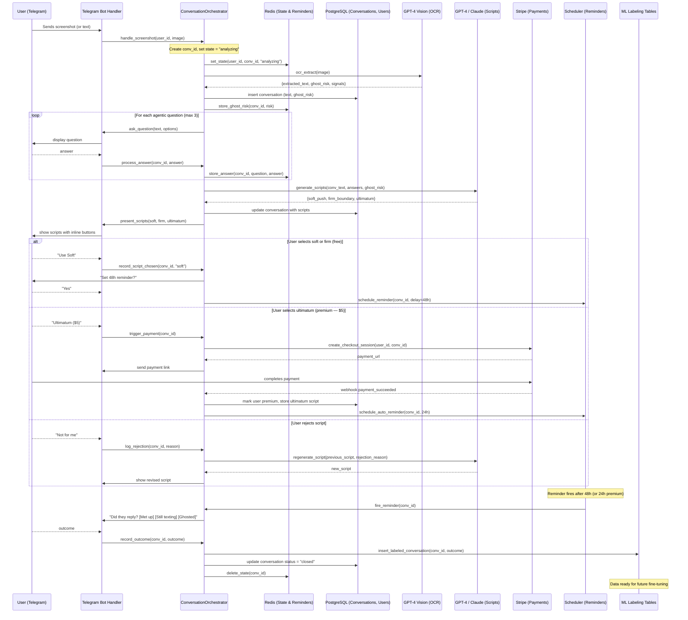

# TURN: Orchestrator Architecture & Fork Strategy
### Technical specification for transforming `AI-dating-assistant` into TURN's MVP

**Document Version:** 1.0
**Date:** June 2026
**Relates to:** [TURN-VISION.md](TURN-VISION.md)

---

## 1. The Fork Strategy

TURN does not build from scratch. It performs a **precision retrofit** of `polikhronidi/AI-dating-assistant`:

- **Keep:** Telegram bot handler, realistic dialogue engine (laddered messages, dynamic delays, debounce), state management patterns, whitelist system
- **Replace:** Both AI "brains" — the Scout (profile analyzer) and the Conversationalist — with our `ConversationOrchestrator`
- **Add:** GPT-4 Vision for screenshot OCR, ghost risk scoring, agentic questioning, script generation, Stripe payments, Redis reminders, PostgreSQL persistence, ML labeling tables

> We're not building a car from scratch; we're replacing the guidance system in a high-performance engine.

---

## 2. Inheritance Map

```
Layer A — Inherited Foundation (polikhronidi/AI-dating-assistant)
  ├── Telegram API Handler (Pyrogram)     → base for bot connectivity
  ├── Realistic Dialogue Engine           → laddered messages, typing delays, read receipts
  ├── Smart Timer / Debounce              → waits for user to finish typing before acting
  ├── Persistent Memory (JSON → upgrade)  → pattern kept, backend upgraded to PostgreSQL + Redis
  └── Whitelist System                    → adapted for premium access control

Layer B — Our New Core Logic (Orchestrator)
  ├── Screenshot ingestion + OCR dispatch
  ├── Ghost risk scoring
  ├── Agentic questioning engine (2-3 adaptive questions)
  ├── Script generation: soft / firm / ultimatum
  ├── Rejection handling + script regeneration
  ├── Reminder scheduler
  ├── Stripe payment trigger
  └── Outcome logging → ML labeling tables
```

### Exact Replacements

| Original Component | Original Purpose | TURN Replacement |
|-------------------|-----------------|-----------------|
| Scout "brain" | Filter profiles, generate openers | Ghost risk analyzer from screenshot |
| Conversationalist "brain" | Continue chats indefinitely | Script generator targeting meetup or closure |
| `generate_conversation_response()` | Return witty chat continuation | Return soft / firm / ultimatum scripts |
| System prompts | "Be charming and engaging" | Ghost risk assessment + script generation prompts |
| Goal: "keep chatting" | Prolong conversation | Force binary outcome: meet or end |

---

## 3. Full Orchestrator Sequence (MVP)



---

## 4. ConversationOrchestrator Class Interface

```python
class ConversationOrchestrator:

    async def handle_screenshot(user_id: str, image: bytes) -> None:
        # Create conv_id, dispatch to VisionAI, store ghost_risk, begin questioning

    async def ask_next_question(conv_id: str) -> Question | None:
        # Return next agentic question or None if all answered

    async def process_answer(conv_id: str, answer: str) -> None:
        # Store answer in Redis; trigger generate_scripts() if all answered

    async def generate_scripts(conv_id: str) -> Scripts:
        # Call TextAI with conversation text + answers + ghost_risk
        # Returns {soft_push, firm_boundary, ultimatum}

    async def handle_rejection(conv_id: str, reason: str) -> Script:
        # Log rejection, call TextAI for regeneration

    async def trigger_payment(conv_id: str) -> str:
        # Create Stripe checkout session, return URL

    async def schedule_reminder(conv_id: str, delay_hours: int) -> None:
        # Store job in Redis sorted set (score = fire_timestamp)

    async def fire_reminder(conv_id: str) -> None:
        # Send outcome question to user via Bot

    async def record_outcome(conv_id: str, outcome: str) -> None:
        # Write to DB + ML labeling tables, clean up Redis state
```

---

## 5. State Schema (Redis)

Key pattern: `turn:user:{user_id}:conv:{conv_id}`

```json
{
  "step": "questioning | generating | awaiting_choice | awaiting_payment | awaiting_outcome | closed",
  "ghost_risk": 0.72,
  "extracted_text": "...",
  "answers": {
    "goal": "meetup",
    "met_before": false,
    "investment_level": "medium"
  },
  "scripts": {
    "soft_push": "...",
    "firm_boundary": "...",
    "ultimatum": "..."
  },
  "chosen_script": "soft_push",
  "premium": false
}
```

Reminders stored in Redis sorted set: `turn:reminders`
Score = Unix timestamp when reminder should fire. Background thread polls every 60s.

---

## 6. Database Schema (PostgreSQL)

```sql
-- Users
CREATE TABLE users (
    user_id TEXT PRIMARY KEY,
    telegram_id BIGINT UNIQUE NOT NULL,
    premium BOOLEAN DEFAULT FALSE,
    created_at TIMESTAMPTZ DEFAULT NOW()
);

-- Conversations
CREATE TABLE conversations (
    conv_id UUID PRIMARY KEY DEFAULT gen_random_uuid(),
    user_id TEXT REFERENCES users(user_id),
    extracted_text TEXT,
    ghost_risk FLOAT,
    answers JSONB,
    scripts JSONB,
    chosen_script TEXT,
    outcome TEXT,  -- 'meetup' | 'ghosted' | 'gave_up' | null
    status TEXT DEFAULT 'active',  -- 'active' | 'closed'
    created_at TIMESTAMPTZ DEFAULT NOW(),
    closed_at TIMESTAMPTZ
);

-- ML Labeling
CREATE TABLE ml_labels (
    conv_id UUID REFERENCES conversations(conv_id),
    ghost_risk_predicted FLOAT,
    ghost_risk_actual BOOLEAN,  -- derived from outcome
    script_chosen TEXT,
    outcome TEXT,
    labeled_at TIMESTAMPTZ DEFAULT NOW()
);

-- Script Rejections (for prompt improvement)
CREATE TABLE script_rejections (
    id SERIAL PRIMARY KEY,
    conv_id UUID REFERENCES conversations(conv_id),
    rejected_script TEXT,
    rejection_reason TEXT,
    created_at TIMESTAMPTZ DEFAULT NOW()
);
```

---

## 7. Key Implementation Notes

### No Auto-Send (Critical Constraint)
Telegram Bot API does not allow bots to send messages on a user's behalf to other users. TURN only provides **copy-paste scripts + reminders**. Auto-send is not possible and should not be advertised.

### Privacy — Image Handling
Delete screenshots from memory immediately after OCR extraction. Never persist raw images to disk or database. On-device processing for the mobile app eliminates the need to upload images at all.

### Agentic Questions (3 Max)
Questions are adaptive — the second question depends on the first answer. Examples:
1. "What's your goal?" → Meet up / Just curious / Want closure
2. (if Meet up) "Have you two met before?" → Yes / No
3. (if No) "How long have you been texting?" → < 1 week / 1-4 weeks / 1+ month

### Script Tone Tuning
Scripts adapt based on:
- Detected conversation vertical (dating / friendship / professional)
- User's stated goal
- Ghost risk level (higher risk → firmer tone)
- User's saved voice profile (premium)

### Reminder Background Thread
```python
# Polls Redis sorted set every 60s
async def reminder_loop():
    while True:
        now = time.time()
        due = redis.zrangebyscore("turn:reminders", 0, now)
        for conv_id in due:
            await orchestrator.fire_reminder(conv_id)
            redis.zrem("turn:reminders", conv_id)
        await asyncio.sleep(60)
```

---

## 8. Differences from Previous Architecture Versions

| Previous (Hybrid) | This Spec (MVP-Refined) |
|-------------------|------------------------|
| Task queue (RQ/Celery) | Direct async orchestrator calls — simpler for MVP |
| Auto-send feature described | Removed — not possible on Telegram |
| Generic GPT prompts only | Includes rejection handling + regeneration loop |
| ML labeling as afterthought | Integrated from conversation close, day one |
| APScheduler (in-process) | Redis sorted set + background thread — survives restarts |

---

## 9. Technology Stack

| Component | Technology | Rationale |
|-----------|------------|-----------|
| Bot framework | `python-telegram-bot` v20+ | Mature, async, large community |
| Fork foundation | `polikhronidi/AI-dating-assistant` | Production-ready dialogue engine |
| Database | PostgreSQL (Neon / Supabase) | Reliable, scalable, good for JSONB |
| State & reminders | Redis (Upstash / Railway) | Fast, ephemeral, TTL-native |
| AI vision | OpenAI GPT-4 Turbo with Vision | Best-in-class text extraction |
| AI text | GPT-4 or Claude 3.5 Sonnet | Script generation + rejection recovery |
| Payments | Stripe Checkout | One-click $5 or subscription |
| Deployment | Railway / Render / Fly.io | Low ops, auto-scaling |
